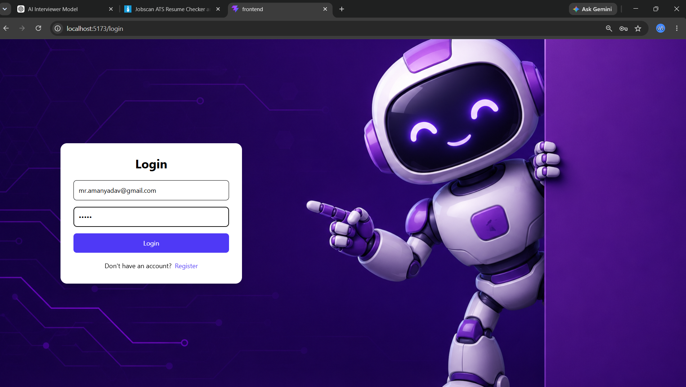
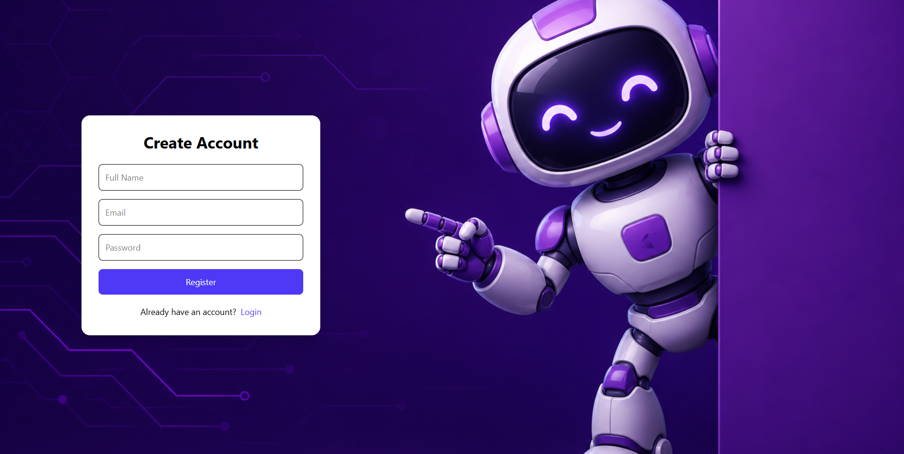
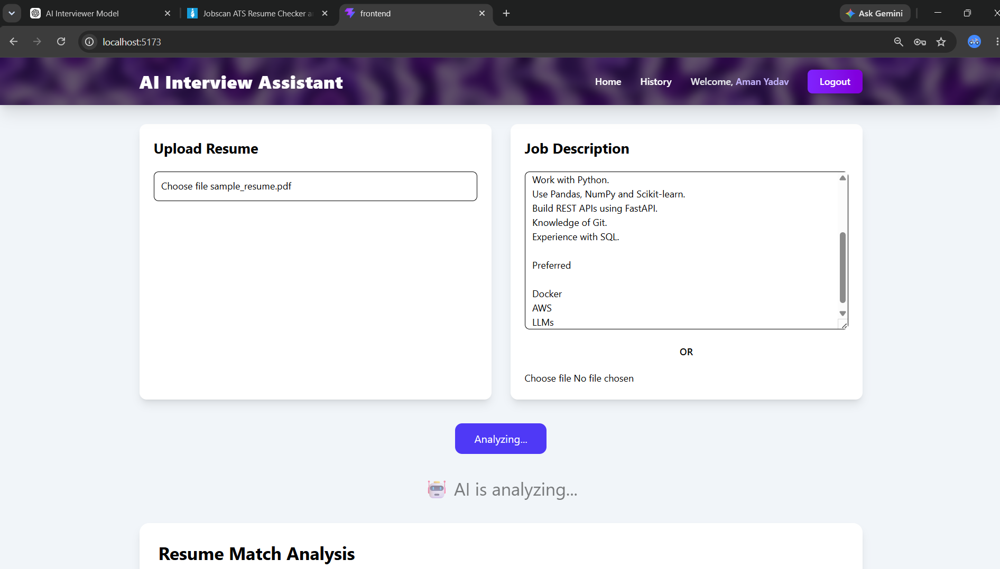
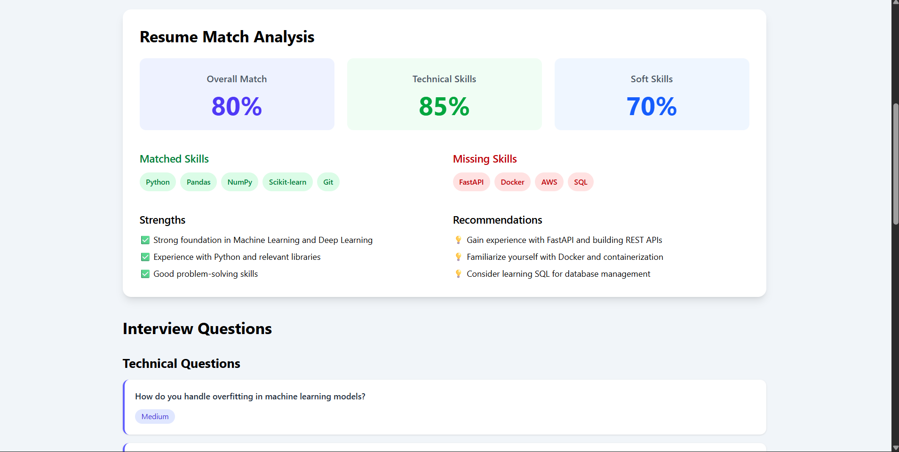
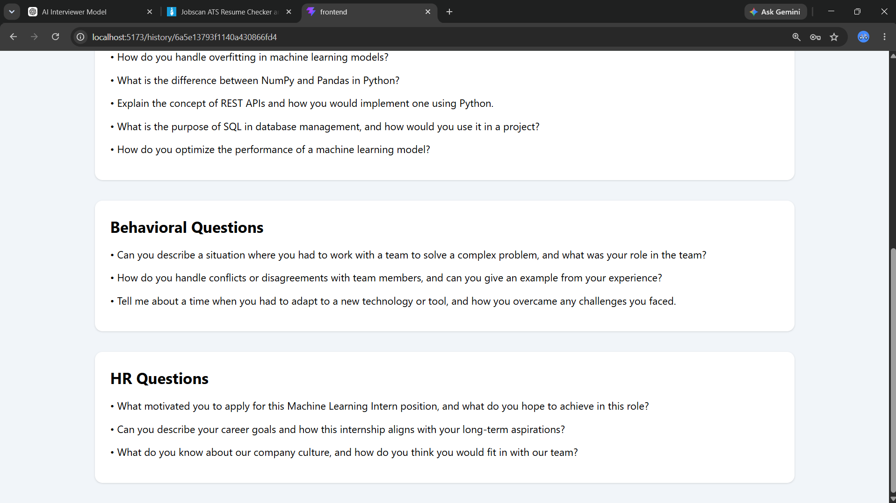
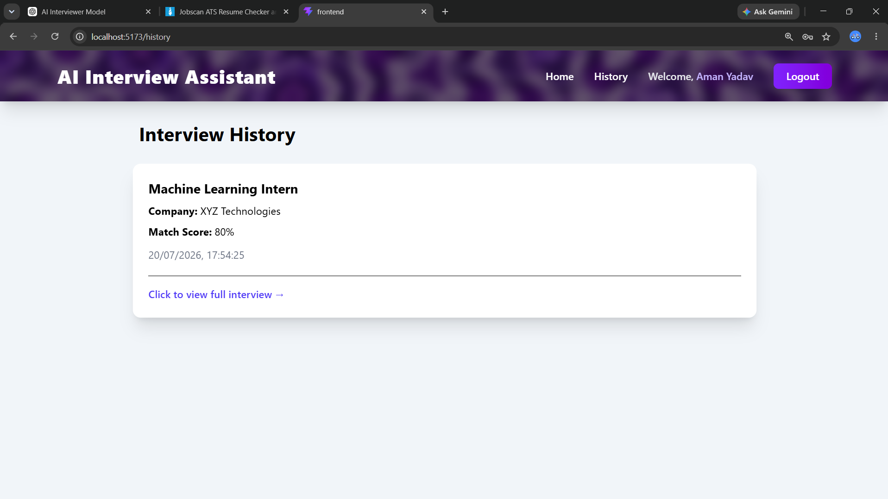

# 🚀 AI Interview Preparation Platform

**An AI-powered interview preparation platform that analyzes resumes against job descriptions, calculates a resume-job match score, and generates personalized interview questions using Large Language Models (LLMs).**


---

# 📌 Features

### 🔐 Authentication
- User Registration
- User Login
- JWT Authentication
- Protected Routes
- Persistent Login (Refresh Safe)

---

### 📄 Resume Analysis
- Upload Resume (PDF)
- AI Resume Parsing
- Extract:
  - Personal Details
  - Skills
  - Education
  - Experience
  - Projects
  - Certifications

---

### 💼 Job Description Analysis
- Paste Job Description
- AI extracts:
  - Required Skills
  - Responsibilities
  - Qualifications
  - Experience Level
  - Company Information

---

### 🎯 Resume Matching
AI compares the Resume with the Job Description and generates:

- Overall Match Score
- Skill Match
- Missing Skills
- Strengths
- Weaknesses
- Improvement Suggestions

---

### 🎤 AI Interview Generator

Generates personalized interview questions based on:

- Resume
- Job Description
- Resume Match Report

Question Categories:

- Technical Questions
- Project Questions
- Behavioral Questions
- HR Questions

---

### 📚 Interview History

Users can:

- View previous interviews
- Open interview details
- View match reports
- Review generated questions

---

# 🛠 Tech Stack

## Frontend

- React
- React Router
- Axios
- Tailwind CSS
- React Toastify

---

## Backend

- Node.js
- Express.js
- MongoDB
- Mongoose
- JWT Authentication
- Multer

---

## AI Service

- FastAPI
- PyMuPDF
- Groq API
- Llama 3.3 70B Versatile

---

# 📂 Project Structure

```
AI-Interview/
│
├── frontend/
│   ├── src/
│   ├── public/
│   └── package.json
│
├── backend/
│   ├── controllers/
│   ├── models/
│   ├── routes/
│   ├── middleware/
│   └── server.js
│
├── ml-service/
│   ├── app2/
│   ├── routes.py
│   ├── main.py
│   └── requirements.txt
│
└── README.md
```

---

# ⚙️ Installation

## 1. Clone Repository

```bash
git clone https://github.com/YOUR_USERNAME/AI-Interview.git

cd AI-Interview
```

---

# Backend Setup

```bash
cd backend

npm install
```

Create a `.env`

```env
PORT=5000

MONGO_URI=your_mongodb_connection

JWT_SECRET=your_secret
```

Run backend

```bash
npm run dev
```

---

# Frontend Setup

```bash
cd frontend

npm install

npm run dev
```

---

# ML Service Setup

```bash
cd ml-service

python -m venv .venv

.venv\Scripts\activate
```

Install dependencies

```bash
pip install -r requirements.txt
```

Create `.env`

```env
GROQ_API_KEY=your_api_key
```

Run

```bash
uvicorn main:app --reload
```

---

# API Overview

## Authentication

```
POST /api/auth/register
POST /api/auth/login
```

---

## Resume

```
POST /parse-resume
```

---

## Job Description

```
POST /parse-jd
```

---

## Resume Matching

```
POST /match
```

---

## Interview Generation

```
POST /generate-interview
```

---

## History

```
GET /api/history
GET /api/history/:id
```

---

# Screenshots

## Login



---

## Register


---

## Dashboard


---

## Resume Match


---

## Interview Questions


---

## History


---

# Future Improvements

- Voice Interview Simulation
- AI Answer Evaluation
- Mock Interview Timer
- Company-wise Interview Sets
- Resume Improvement Suggestions
- Dashboard Analytics
- Email Authentication
- Admin Panel

---

# Author

**Aman Kumar Yadav**

GitHub:
https://github.com/mr-amanyadav

LinkedIn:
https://linkedin.com/in/aman-kumar-yadav-468954330

---

# License

This project is licensed under the MIT License.
